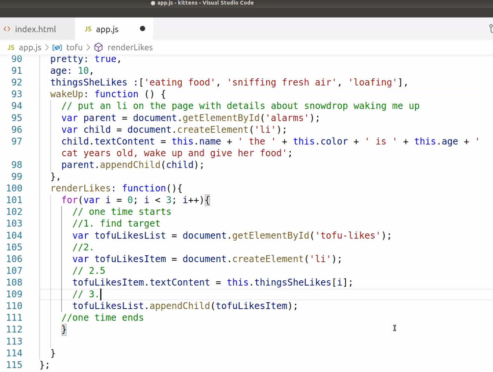

# Salmon Cookies Project 
**Author:** Tif Taylor | **Class:** Code Fellows 201 | **Date:** July 2020

**About:**  
We were given a Problem Domain about a friend who wants to start a confection item called Salmon Cookies. They want our help creating internal data managent around customs and cookies per day values in addition to the customer facing website for the company. This project spans multiple lab project days for the second week in Code Fellows 201 course. 

**Resources:**
- Generating random number, I used a [geeksforgeeks page](https://www.geeksforgeeks.org/javascript-math-random-method/)
- Classmate [Jack Nelson](https://github.com/jnelsonjava) helped me think through storing the simulated cookie amounts and times of day as 24 hour representation to get an array I'll use with my cookies per hour array
- Used screenshot from Class Demo done by Nicholas Carignan, stored on the [Code Fellows 201d65 Class Repo](https://github.com/codefellows/seattle-201d65):   
  
- To center my image I checked this [w3schools link](https://www.w3schools.com/howto/howto_css_image_center.asp)
- 